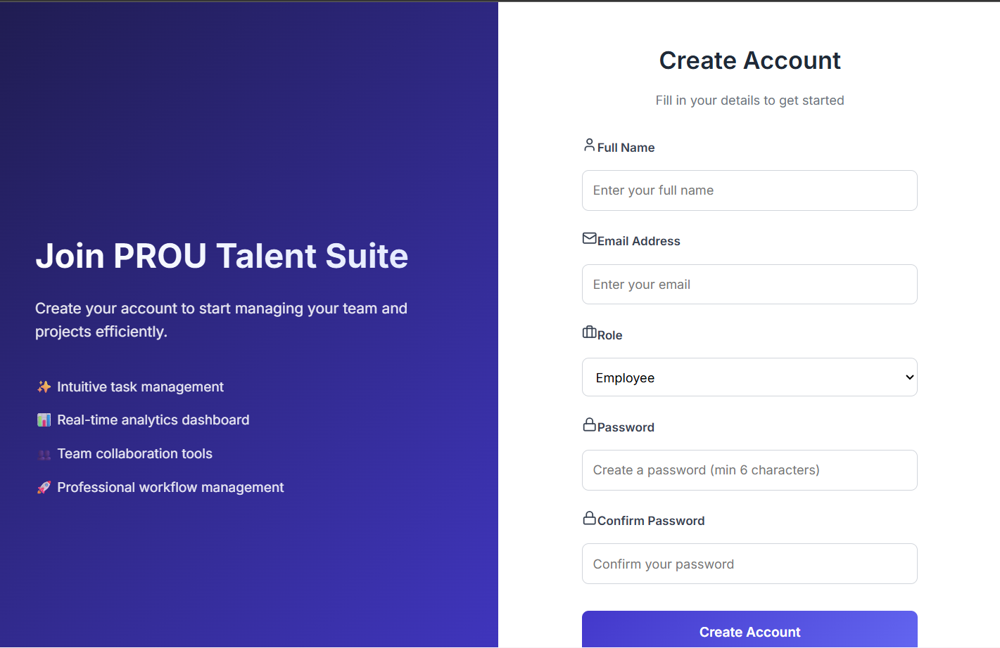
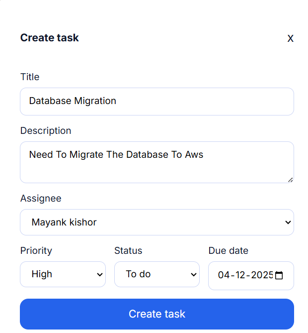
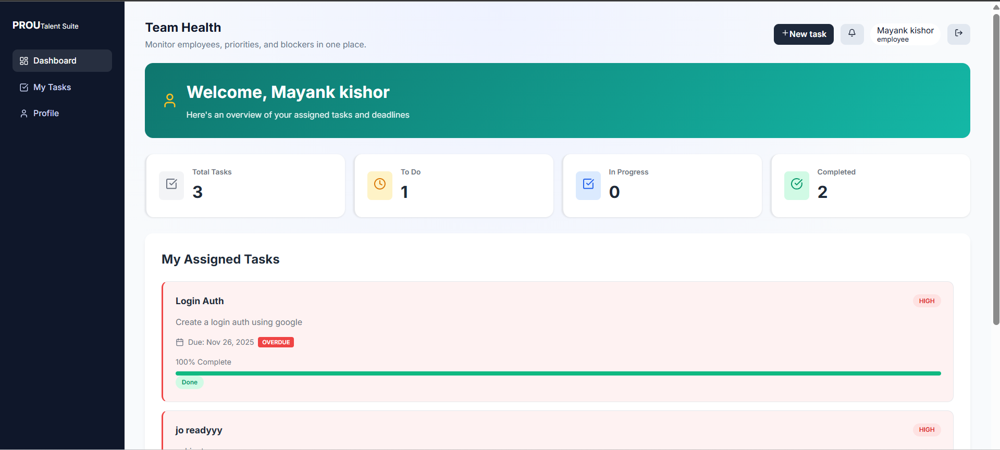
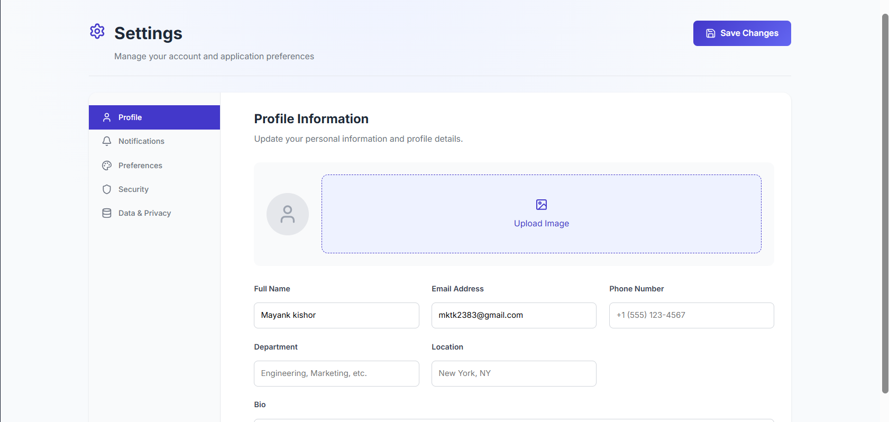

<div align="center">

# Track 1 + 2 + 3 · Employee & Task Ops Suite

React + Express + MongoDB implementation that satisfies the Frontend, Backend, and Full‑stack variants of the assignment in a single repository. The UI can run fully on mock data, while the API powers real CRUD once MongoDB is connected.

</div>

## Tech Stack

- **Frontend:** React 19, Vite, TypeScript, TanStack Query, Zustand, Framer Motion, Axios, Lucide icons.
- **Backend:** Node 20+, Express 5, TypeScript, Mongoose, Zod, JWT auth, bcrypt.
- **Database:** MongoDB (local Docker, Atlas, or Render free tier).
- **Shared:** Type-safe models plus seeded mock data under `shared/` imported by both React and Express.
- **Tooling:** npm workspaces, ts-node-dev, Vite proxy, Render + Netlify deploy descriptors.

## Repository Layout

```
frontend/    # Vite React SPA (mock + live data, JWT-gated writes)
backend/     # Express API + MongoDB, JWT auth, analytics, seeders
shared/      # Reusable types + mock JSON data
docs/        # Drop screenshots (.png) and recordings (.mp4) before submission
render.yaml  # Backend + frontend deployment blueprint for Render + Netlify
netlify.toml # Production build config for the SPA
env.template # Copy to backend/.env for local secrets
```

## Features Checklist

### 🔐 Authentication & User Management
- **Complete Signup/Login System:** Users can create accounts and sign in with proper validation
- **Database-Driven Auth:** All user credentials stored in MongoDB with bcrypt hashing
- **JWT Authentication:** Secure token-based authentication with 8-hour expiry
- **Role-Based Access:** Admin, Manager, and Employee roles with different permissions
- **User Profiles:** Complete profile management with avatars, contact info, and preferences

### 📊 Professional Dashboard
- **Separate Pages:** Dedicated pages for Overview, Employees, Tasks, and Settings
- **Real-time Analytics:** Live statistics and charts for team performance
- **Responsive Design:** Mobile-friendly interface with professional styling
- **Interactive Navigation:** Smooth routing between different sections

### 👥 Employee Management
- **Complete Employee Profiles:** Name, email, role, department, skills, bio, phone, location
- **Employee Directory:** Searchable and filterable employee listing
- **Add/Edit Employees:** Admin and managers can create and update employee profiles
- **Status Tracking:** Active, on-leave, and inactive employee status
- **Department Organization:** Group employees by departments
- **Skills Management:** Tag-based skill tracking for team members
- **Avatar Support:** Profile photos with automatic fallback generation
- **Role-Based Access:** Only admins and managers can modify employee data

### ✅ Task Management
- **Kanban Board:** Visual task board with drag-and-drop functionality
- **Task CRUD:** Create, read, update, and delete tasks with full validation
- **Priority System:** High, medium, and low priority tasks with visual indicators
- **Status Workflow:** Todo, In-Progress, Blocked, and Done status tracking
- **Assignment System:** Assign tasks to team members
- **Progress Tracking:** Percentage-based progress monitoring
- **Due Date Management:** Track deadlines and overdue tasks
- **Comments & Attachments:** Enhanced task details with collaboration features

### ⚙️ Settings & Preferences
- **Profile Management:** Update personal information and avatar
- **Notification Settings:** Customize email and system notifications
- **Application Preferences:** Theme, language, timezone, and date format options
- **Security Settings:** Password management and two-factor authentication
- **Data & Privacy:** Export data and account management options

### 🛠️ Technical Features
- **Database Integration:** All data stored and retrieved from MongoDB
- **Timestamps:** Automatic creation and update timestamps for all entities
- **Data Validation:** Comprehensive input validation using Zod schemas
- **Error Handling:** Proper error messages and fallback states
- **Loading States:** Professional loading indicators and skeleton screens
- **Responsive Design:** Mobile-first approach with tablet and desktop optimization

## Prerequisites

| Tool | Version | Notes |
| --- | --- | --- |
| Node.js | **>= 20.19.0** | Required by Vite 7 and Mongoose 9. Upgrade if you see warnings. |
| npm | >= 10 | Bundled with recent Node LTS. |
| MongoDB | Local Docker (`mongodb/mongodb-community`), MongoDB Atlas, or Render free tier. |

## Local Setup

```bash
git clone https://github.com/<you>/prou-track-suite.git
cd prou-track-suite
cp env.template backend/.env         # update MONGODB_URI + JWT_SECRET
npm install                          # installs workspace deps
npm run dev                          # launches backend (4000) + frontend (5173)
```

- Backend runs on `http://localhost:4000`.
- Frontend proxies `/api` to the backend during development (configured via `vite.config.ts`).
- Seed data (employees, tasks, admin user) is created automatically the first time the API connects.

## Useful Scripts

| Command | Description |
| --- | --- |
| `npm run dev` | Concurrent frontend + backend dev servers. |
| `npm run frontend:build` | Type-check + bundle the SPA (outputs `frontend/dist`). |
| `npm run backend:build` | Compile Express TypeScript to `backend/dist`. |
| `npm run backend:lint` | `tsc --noEmit` for the API. |
| `npm run frontend:lint` | ESLint via Vite config. |

## Environment Variables (`backend/.env`)

```
# Required variables
MONGODB_URI=mongodb://localhost:27017/prou_assignment
JWT_SECRET=super-secret-key
PORT=4000
SEED_PASSWORD=ChangeMe123!

# Cloudinary Configuration (optional but recommended for production)
CLOUDINARY_CLOUD_NAME=your_cloud_name
CLOUDINARY_API_KEY=your_api_key
CLOUDINARY_API_SECRET=your_api_secret
```

### Cloudinary Setup Instructions

1. **Create a Cloudinary Account**
   - Go to [Cloudinary.com](https://cloudinary.com/) and sign up for a free account
   - The free tier provides 25GB storage and 25GB monthly bandwidth

2. **Get Your API Credentials**
   - After signing up, go to your Cloudinary Dashboard
   - Find your Cloud Name, API Key, and API Secret in the "Account Details" section

3. **Add Credentials to Environment Variables**
   - Copy the values to your `.env` file:
     ```
     CLOUDINARY_CLOUD_NAME=your_cloud_name
     CLOUDINARY_API_KEY=your_api_key
     CLOUDINARY_API_SECRET=your_api_secret
     ```

4. **Restart the Server**
   - After adding the environment variables, restart your server
   - The application will automatically detect and use Cloudinary for image uploads

5. **Test Image Upload**
   - Try uploading an employee profile photo
   - The image should be stored in Cloudinary and the URL will be saved in the database

## API Documentation

### Authentication Endpoints
| Endpoint | Method | Description |
| --- | --- | --- |
| `/api/auth/signup` | POST | Create new user account |
| `/api/auth/login` | POST | Authenticate user and return JWT token |

### Employee Management
| Endpoint | Method | Description |
| --- | --- | --- |
| `/api/employees` | GET | List all employees with filtering |
| `/api/employees` | POST | Create new employee (auth required) |
| `/api/employees/:id` | GET | Get employee details |
| `/api/employees/:id` | PUT | Update employee (auth required) |
| `/api/employees/:id` | DELETE | Delete employee (auth required) |

### Task Management
| Endpoint | Method | Description |
| --- | --- | --- |
| `/api/tasks` | GET | List tasks with filters (?status, ?priority, ?assignedTo, ?search) |
| `/api/tasks` | POST | Create new task (auth required) |
| `/api/tasks/:id` | GET | Get task details with comments |
| `/api/tasks/:id` | PUT | Update task (auth required) |
| `/api/tasks/:id` | DELETE | Delete task (auth required) |

### Analytics & Reporting
| Endpoint | Method | Description |
| --- | --- | --- |
| `/api/analytics/summary` | GET | Get dashboard analytics and statistics |

## Application Structure

### Frontend Pages
- **`/login`** - User authentication with signup link for new users
- **`/signup`** - Account creation with role selection
- **`/`** - Dashboard overview with analytics and recent activity
- **`/employees`** - Employee directory with search, filters, and management
- **`/tasks`** - Task management with kanban board and detailed views
- **`/settings`** - User profile, preferences, and account settings

### Database Schema
- **Users:** Authentication, profile data, roles, and preferences
- **Employees:** Team member information, skills, and organizational data
- **Tasks:** Project tasks with assignments, progress, comments, and attachments
- **All entities include automatic timestamps and audit trails**

## How to Use

### 🔐 **Authentication System**

#### Default Admin Credentials
- **Email:** `mayankkishor53@gmail.com`
- **Password:** `Mayank@123`

#### Sign Up Process
1. **Admin Signup:** Only pre-authorized email addresses can create admin accounts
2. **Employee Signup:** Employees can sign up with any email that has been pre-registered by an admin
3. **Email Validation:** System validates email eligibility before account creation
4. **Unauthorized Access:** Shows contact admin message with direct Gmail link

### 🎛️ **Admin Dashboard** (`/`)
*Available only to users with admin role*

1. **Complete System Control:** Full analytics, task management, and employee oversight
2. **Admin Management Panel:** 
   - Add new admin email addresses
   - New admins can then signup with those emails
   - Cannot remove the default admin account
3. **Employee Management:** Create, edit, and manage all employee profiles
4. **Task Oversight:** View and manage all tasks across the organization
5. **Analytics:** Comprehensive dashboard with team performance metrics

### 👤 **Employee Dashboard** (`/`)
*Available to employees and managers*

1. **Personal Task View:** See only tasks assigned to you
2. **Task Statistics:** Personal productivity metrics and deadlines
3. **Task Completion:** Mark tasks complete with detailed submission forms
4. **Progress Tracking:** Visual progress bars and status indicators
5. **Deadline Alerts:** Overdue task notifications and warnings

### 📋 **Detailed Workflows**

#### Admin Workflow
1. **Login** with admin credentials (`mayankkishor53@gmail.com` / `Mayank@123`)
2. **Add Admins:** Use Admin Panel to add new admin email addresses
3. **Manage Employees:** Create employee profiles with complete details
4. **Assign Tasks:** Create and assign tasks to team members
5. **Monitor Progress:** Track task completion and team performance

#### Employee Workflow
1. **Signup/Login** with authorized email address
2. **View Tasks:** See all assigned tasks with priorities and deadlines
3. **Complete Tasks:** Submit completion reports with file attachments
4. **Track Progress:** Monitor personal productivity and task status

### 🔒 **Role-Based Access Control**

#### Admin Permissions
- Full access to all features and data
- Can create/edit/delete employees and tasks
- Can add new admin users
- Access to complete analytics dashboard
- Can view all task submissions and provide feedback

#### Manager Permissions  
- Can create and edit employees and tasks
- Cannot delete critical data
- Limited admin panel access
- Can view team analytics

#### Employee Permissions
- Can view assigned tasks only
- Can complete and submit tasks
- Can edit own profile
- Cannot access employee management
- Cannot create or assign tasks

### 🚨 **Security Features**
- **Email Validation:** Only authorized emails can create accounts
- **JWT Authentication:** Secure token-based session management
- **Role Verification:** Server-side role validation for all operations
- **Contact Admin:** Direct Gmail integration for access requests
- **Data Protection:** All sensitive operations require authentication

All data is stored in MongoDB with real-time synchronization, comprehensive validation, and audit trails.

Front-end optional `.env` (for production deployments):

```
VITE_API_URL=https://<your-api>.onrender.com/api
```

## API Overview

| Method | Endpoint | Auth | Description |
| --- | --- | --- | --- |
| `POST` | `/api/auth/login` | – | Returns JWT + user profile. |
| `GET` | `/api/employees` | – | List employees. |
| `POST` | `/api/employees` | `admin/manager` | Create employee. |
| `PUT` | `/api/employees/:id` | `admin/manager` | Update employee. |
| `DELETE` | `/api/employees/:id` | `admin` | Remove employee. |
| `GET` | `/api/tasks` | Any authenticated user | Filterable by `status`, `priority`, `assignedTo`, `search`. |
| `POST` | `/api/tasks` | `admin/manager` | Create task. |
| `PUT` | `/api/tasks/:id` | `admin/manager` | Update task. |
| `DELETE` | `/api/tasks/:id` | `admin` | Delete task. |
| `GET` | `/api/analytics/summary` | Any authenticated user | Aggregated KPIs for dashboard cards. |

All write endpoints enforce a 5 MB JSON/body limit to align with the upload requirement.

## Frontend Workflow

1. **Login:** Enter seeded credentials or click “Explore demo (mock data only)”.
2. **Dashboard:** Analytics cards, task filters, kanban board, and employee spotlight populate either from live data or the shared mock dataset (fallback + offline support).
3. **Task Modal:** Create/update tasks with optimistic cache invalidation; surfaced errors when the API rejects (e.g., demo mode or permission issues).

## Deployment Notes

- **Render:** `render.yaml` provisions two services—Express API (Node 20 build) + optional static frontend. You can also serve the built React app from Express by copying `frontend/dist` into `backend` before `npm run backend:build`.
- **Netlify:** `netlify.toml` builds the SPA with `npm run build` and serves `frontend/dist`. Set `VITE_API_URL` to your deployed API.
- **MongoDB:** Use MongoDB Atlas’ free Shared tier, Render’s managed Mongo, or `docker run -p 27017:27017 mongo:6`.

## Screenshots & Application Overview

### Authentication Screens

*Signup page allowing users to create accounts with email and password*


*Login page with authentication validation*

### Admin Dashboard

*Admin dashboard showing analytics and task overview*


*Employee management interface for adding and editing employees*

### Task Management

*Task creation interface with assignment options*


*Kanban-style task board showing task status*

### Employee Dashboard

*Employee dashboard showing assigned tasks*


*Task submission interface with file upload capability*

### Feature Demonstrations

*File upload interface supporting multiple file types up to 10MB*


*User profile and settings management*

### Application Workflow Demonstrations

The application supports three main user workflows:

**Admin Workflow:**
- Complete system administration including user management and analytics
- Creating and managing employee accounts with role-based permissions
- Assigning tasks to employees with deadlines and priority levels
- Monitoring task progress and completion through the analytics dashboard
- Managing system settings and user permissions

**Employee Workflow:**
- Secure login and personalized dashboard experience
- Viewing assigned tasks with detailed descriptions and deadlines
- Submitting completed tasks with file attachments (PDF, PPTX, DOCX, images up to 10MB)
- Real-time task status updates and progress tracking
- Profile management and settings customization

**Authentication & Security:**
- Robust signup and login system with email validation
- Role-based access control (Admin, Manager, Employee)
- JWT token-based authentication with secure session management
- Password validation and error handling for invalid credentials
- Automatic redirection based on user roles and permissions

## Bonus Ideas Already Implemented

- ✅ Attempted all three tracks with a single cohesive codebase.
- ✅ JWT authentication with role-based access control.
- ✅ Analytics dashboard & priority chart.
- ✅ Mock/demo mode toggle for reviewers.
- ✅ Deployment manifests (Render + Netlify) and static serving fallback.

## Next Steps / Improvements

- Plug in role-specific UI (e.g., vendor/admin toggles) if requirements expand.
- Add automated tests (Jest + Supertest + React Testing Library).
- Wire file uploads (≤5 MB) for employee avatars/tasks once the requirement solidifies.

---


